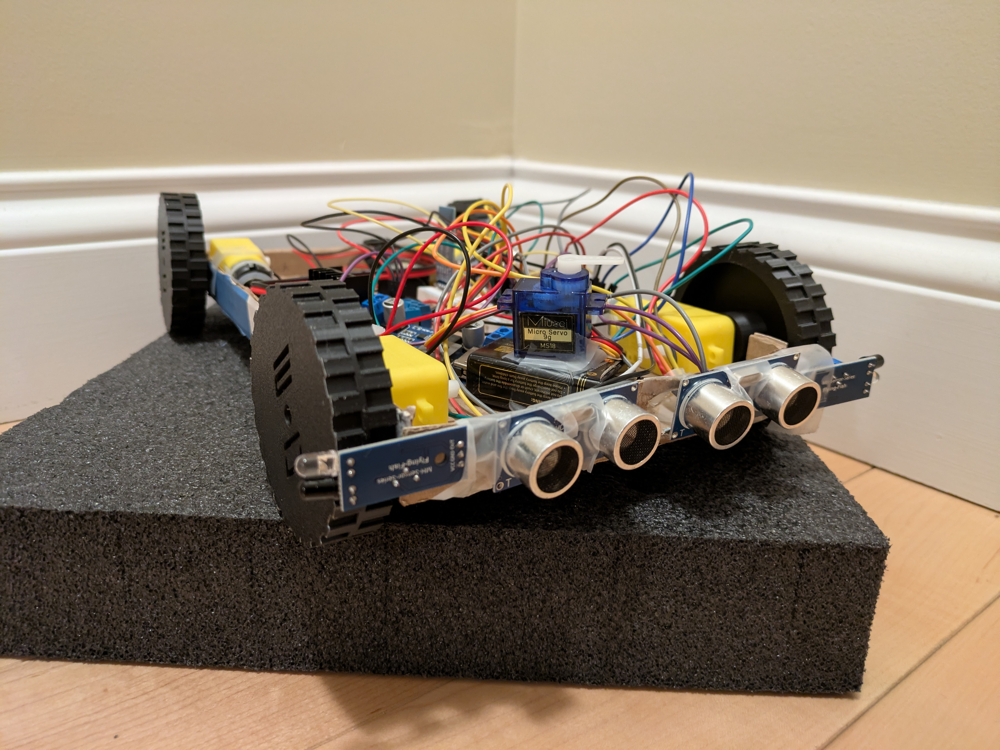
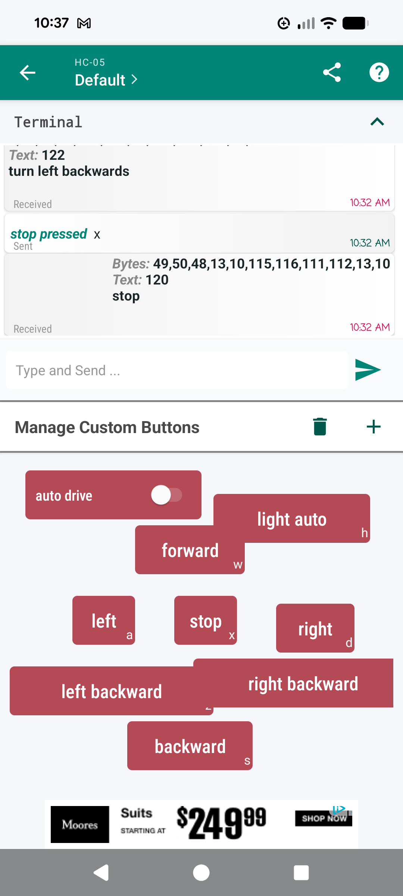

# Apollo 15 Lunar Rover Model v0
A Bluetooth-controlled model of the Apollo 15 lunar rover using an Arduino Nano and an HC-05 Bluetooth module.

#### Check out the project on Stardance! https://stardance.hackclub.com/projects/1942

## Description
The Apollo 15 Lunar Rover Model is a robot controlled by Bluetooth designed to look as similar as possible to the actual lunar roving vehicle used by Commander David Scott and Lunar Module Pilot James Irwin during the Apollo 15 mission. It can be driven using Bluetooth or set to navigate on its own using two ultrasonic sensors and two IR sensors. The ultrasonic sensors detect obstacles in the path of the rover as it moves forward and the IR sensors are used to check which direction is clear to turn backwards when the rover encounters an obstacle. It also has two LED headlights which can be turned on and off using bluetooth or set to turn themselves on and off depending on the light level detected by a photoresistor. The rover is powered by two 9v batteries: one to power the Arduino, HC-05 module and other components through a 9v-5v buck converter and one to provide power to the motors.

At the moment, the model doesn't look very similar to the actual roving vehicle. This is because the current version of the robot is a prototype built with cardboard to test the code and capabilities of the sensors. Version 0 is being shipped simply to show the process of creating the eventual version 1, which will feature a 3D printed chassis, an improved control app, and will resemble the actual rover much more. The rover is not very sturdy and is intended to be used as an educational tool or to be driven inside.

## Inspiration 
After watching NASA's contract award livestream and seeing some cool designs for future lunar rovers, I was inspired to make a robot modeled after the Apollo 15 Lunar Roving Vehicle. While the current version admittedly looks nothing like the actual rover, I am working on designing a 3d-printable chassis and accessories to pay tribute to the only lunar rover used during the Apollo missions.

## Getting started
To get started with the current version of the Lunar Rover Model, you will first need to build the cardboard chassis. For instructions on building and wiring the rover, check out [this guide](Construction/building_the_chassis.md).

Once the chassis is built and the components are wired, it is time to flash the firmware to the Arduino. If you want your rover to simply drive itself around with no help from a driver, copy the code from lunar-rover-obstacle-detectv0.4.ino and paste it in the Arduino IDE. You can also download the file, place it in a folder named [lunar-rover-obstacle-detectv0.4](Firmware/lunar-rover-obstacle-detectv0.4.ino) and open it in the IDE. If you want the rover to be able to be driven or to be set to self-navigation, copy the code from [lunar-rover-completev0.2.ino](Firmware/lunar-rover-completev0.2.ino) and paste it in the Arduino IDE. Before flashing the code to the Arduino, you MUST disconnect the Bluetooth module from the Arduino. This is because if you don't, the Arduino will prioritize its serial communication with the Bluetooth module over the USB connection and you will get an error message.

To control the rover with Bluetooth, you will have to install a controller app on your device. I have used this one with great results: https://play.google.com/store/apps/details?id=com.tools.ArduinoBluetooth on Android. You will also need to make the buttons in the app send the correct code to the Arduino. The serial codes are as follows:

Forward = w

Backwards = s

Left = a

Right = d

Left backwards = z

Right backwards = c

Stop = x

Auto drive on = r

Auto drive off = e

Lights on = f

Lights off = g

Lights auto = h

Your configuration will probably look something like this:

After configuring the buttons in the app, you will be able to control the rover with your mobile device. If you use an iOs device, you may have to do some troubleshooting to find an app that works well. I was planning to make a custom app for the rover, but I don't know much about it and I wanted to focus on the rover itself. If anyone would like to make an app for this project, they are welcome to and I would appreciate if they let me know.

## Troubleshooting

If you are having issues with the motors, check that you have connected GND on the motor driver board to the ground rail on the breadboard as well as the ground of the battery.

If the rover is moving backwards randomly when when self-navigation is enabled, adjust the angle of the ultrasonic sensors. If they are tilted down they will pick up the floor as an obstacle.

If you are having trouble reconnecting the HC-05 to your phone, try making your phone "forget" the device and pair it again. You may be asked to enter a PIN to connect to the module. The code is usually 1234 or 0000.

If you encounter other problems, feel free to send a question to fish.in.a.puddle42@gmail.com. I'll see if I can help.

## Credits

Original wheel models: https://www.thingiverse.com/thing:5636299

